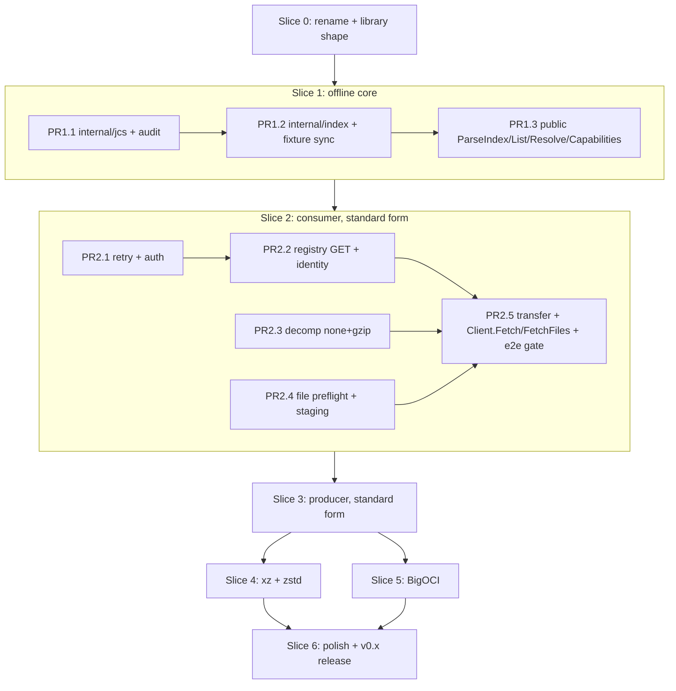

# Implementation Plan: `imgoci/go` — canonical Go implementation of imgoci v1

Source of truth: `ARCHITECTURE.md` (`.wt/journal-jmgilman/.journal/001/ARCHITECTURE.md`, final, updated 2026-08-15). All `§` citations below refer to it unless prefixed `spec §`. Normative spec: `~/code/imgoci/spec/spec.md`; fixtures: `~/code/imgoci/spec/conformance/v1/{pass,fail}`.

Working conventions for every PR in this plan:
- Branch in a Worktrunk worktree under `.wt/` (`wt` skill); the journal branch is never an implementation base.
- GitHub squash-merge; PR title is the Conventional Commit subject given per item.
- Every package created gets a `doc.go` (D4), godoc on all functions/types/fields (D1), files under 1,000 lines (R2), hexagonal boundaries (A1–A4), mocks only via mockery (T2/T3).
- A slice is closed only by its functional-test gate — "nothing is done on unit tests alone" (§8).

---

## 1. Overview

The plan maps 1:1 onto the architecture's delivery slices (§8): slice 0 rename pass → slice 1 offline core → slice 2 consumer vertical (standard form) → slice 3 producer (standard) → slice 4 full compression → slice 5 BigOCI → slice 6 polish/release. Three cross-cutting tracks (CI/tooling, docs, release plumbing) run alongside and are scheduled into specific slice PRs rather than batched at the end.

Dependency notes: PR2.1/2.3/2.4 are mutually independent (parallelizable); slice 4 and slice 5 are independent of each other (both need slice 3's round trip for their e2e suites); slice 6 needs both. Within slice 5, the stored cache (PR5.2) needs the profile reader (PR5.1).

Module dependency arrival schedule (§2 "Direct dependencies"):

| Dependency | Enters at | Why |
|---|---|---|
| `opencontainers/go-digest` | 1.2 | `Index.Digest()`, content digests |
| `gowebpki/jcs` v1.0.1 (pinned by audit) | 1.1 | §6.2 transform |
| `distribution/reference` | 2.2 | `Reference` parsing |
| `imgoci/go-oci-blob` v1.1.1 | 2.2 | blob wire kernel |
| `stretchr/testify`, `testcontainers-go` | 2.5 | test-only |
| `ulikunitz/xz`, `klauspost/compress` | 4 | strict decoders |
| `imgoci/bigoci` v0.2.0, `opencontainers/image-spec` | 5.1 | multipart transport, `ocispec.Descriptor` |
| ORAS credential store | 6.1 | `WithDockerCredentials` |

---

## 2. Slice 0 — rename pass and library shape (§8 slice 0, §2)

One PR. The repo is an unrenamed `meigma/template-go` clone; this slice makes it `github.com/imgoci/go`, `package imgoci`, library-shaped, CI green. The template's own `DELETE_ME.md` "library-only" path is the checklist authority for what to trim.

### PR0.1 — `chore: adopt imgoci/go module identity and library shape`

**(a) Files:**
- `go.mod`: `go mod edit -module github.com/imgoci/go`; then `go mod tidy` (drops Cobra/Viper once the CLI is deleted). Keep `go 1.26.4` (mise pin governs).
- Delete: `cmd/template-go/`, `internal/cli/`, `internal/config/`, `internal/templateinfo/` (§2: "The template's `cmd/template-go` and root-module CLI wiring are deleted in the rename pass"). The `cli/` submodule is NOT created now — it lands in slice 6 (§8).
- Create root `doc.go`: `package imgoci` with package godoc naming the implemented spec revision (§9.1: "implemented revision pinned in docs"). Add a trivial compile anchor only if needed; prefer the doc.go alone plus a placeholder-free `errors.go` deferred to slice 1 — `go build ./...` on a doc-only package is valid.
- Library-only trim per `DELETE_ME.md` §6: delete `.goreleaser.yaml`, `ghd.toml`, `melange.yaml`, `apko.yaml`, `.github/workflows/release.yml`, `.github/workflows/release-dry-run.yml`, `.github/workflows/attest.yml`, `.github/workflows/security-scan.yml`. Keep `.github/workflows/{ci.yml,docs-pages.yml,release-please.yml}`, `release-please-config.json`, `.release-please-manifest.json`, `CHANGELOG.md` (library still gets changelogs/tags/draft releases — see track C).
- `release-please-config.json`: `package-name: "go"` (component), drop `extra-files: ["melange.yaml","apko.yaml"]`; keep `bump-minor-pre-major` (stays 0.x until spec promotes, §9.1). Reset `.release-please-manifest.json` to `{".":"0.0.0"}` and truncate `CHANGELOG.md` to a baseline entry.
- `moon.yml`: project `title: 'go'`, `description`, `owner: 'imgoci'`, `maintainers: ['jmgilman']`, `layer: 'library'` (match `~/code/imgoci/bigoci/moon.yml`). `build` task → `go build ./...` (no `bin/` output, `cache: false`, bigoci pattern). `fileGroups.goSources` → `['*.go','internal/**/*.go','go.mod','go.sum','mise.toml','mise.lock']` (root package layout). `releaseConfig` group loses goreleaser/ghd entries. `test` task → `go test -race ./...` (bigoci precedent; race is load-bearing once concurrent staging exists).
- `.github/repository-settings.toml`: remove `Binary Release Dry Run` / `Container Image Dry Run` required checks (DELETE_ME library path).
- `.github/dependabot.yml`: remove the Docker ecosystem entry (no base images remain).
- `docs/mkdocs.yml`: site name `imgoci/go`, Pages URL `https://imgoci.github.io/go/`; `docs/docs/index.md` one-paragraph rewrite.
- `README.md`: minimal honest rewrite (library under development, spec link, sibling links); review `CONTRIBUTING.md`/`SECURITY.md` names; add `LICENSE-APACHE`/`LICENSE-MIT` copied from bigoci (sibling dual-license convention). Delete `DELETE_ME.md`.
- Sweep: `rg "template-go|TEMPLATE_GO|meigma"` must return nothing outside `.wt/`/`scaffold/`.

**(b) Notes:** §2 rejects `github.com/imgoci/go/imgoci`; root package is `imgoci` (yaml.v3 pattern). Do not touch mise pins.

**(c) Tests:** none new; existing template tests deleted with their packages.

**(d) Verification / gate:** `moon run root:check` green locally (format, lint, build, test, docs:build); CI (`moon ci --summary minimal`) green on the PR. That is the slice gate — hours, not days.

---

## 3. Slice 1 — offline core (§8 slice 1; §§3.1, 4, 6.1, 6.2, 7)

Three PRs, strictly ordered. Pure packages: stdlib + go-digest + jcs only.

### PR1.1 — `feat: add RFC 8785 canonicalization gate (internal/jcs)`

**(a) Files:** `internal/jcs/{doc.go, jcs.go, dupscan.go, jcs_test.go, dupscan_test.go, audit_test.go}`; `testdata/jcs/` (RFC 8785 vector corpus files).

**(b) Notes (§6.2, §4 table row):**
- `Verify(original []byte, parsed any) error` implements the fixed order: (1) `utf8.Valid(original)` — the load-bearing pre-gate (gowebpki copies invalid bytes unvalidated; `encoding/json` substitutes U+FFFD); (2) token-level duplicate-key scan comparing keys **after** JSON string decoding (`"\u0061"` ≡ `"a"`) — defense-in-depth that survives a dependency swap; (3) full-domain `jcs.Transform` of the parsed value, byte-compare with input.
- `Encode(v any) ([]byte, error)`: `json.Marshal` → same transform. Caller strings are validated upstream (`utf8.ValidString`), documented as a precondition here.
- The wrapper isolates `gowebpki/jcs` so it is swappable (tracked successor: `encoding/json/jsontext` `Value.Canonicalize`, §9.3).
- **Decision point (§9.3, scheduled here):** the pin is confirmed only when the executable audit suite passes. If the RFC vector corpus fails against v1.0.1, the floor is fork-and-fix of the cyberphone reference port — the `internal/jcs` API does not change either way. Record the outcome in the PR description.

**(c) Tests:** full RFC 8785 test vectors; §6.2 negative audit suite as executable tests: invalid UTF-8 in values/keys, overlong `\xc0\xaf`, decoded-equal duplicates, lone surrogates (transform errors), invalid surrogate *pairs* (accepted by transform, must be caught by byte-compare), `1e400`/`NaN` (error), `2⁵³+1` and `-0` (caught by byte-compare), `1e2`→`100`, `[1 2]` grammar hole (documents why Decode must precede Verify — the audit framing property: "every non-canonical/non-I-JSON input surviving pre-gate + Decode errors or produces output ≠ input").

**(d) Verification:** `go test ./internal/jcs/ -race`; `moon run root:check`. Gate: audit suite green = pin confirmed.

### PR1.2 — `feat: add release-index codec, ten-rule validator, and conformance corpus`

**(a) Files:** `internal/index/{doc.go, decode.go, validate.go, verify.go, build.go, sort.go}` + `_test.go` per file; `testdata/conformance/v1/{pass,fail}/` (synced copies), `testdata/conformance/SPEC_COMMIT`; `.github/scripts/sync_conformance.sh`; new moon task + CI wiring (track A, delivered in this PR).

**(b) Notes (§4 `internal/index` row, §6.8):**
- Three seams, exactly as specified: `Decode(bytes)` — UTF-8 gate, JSON shape, duplicate keys, preserves **all** members incl. unknown values in a generic tree (rule-10 verification must see them; conformance `additional-members.json` must pass); `Validate(value)` — rules 1–9 as separate table-driven checks each naming its spec rule in the error detail (`ErrInvalidIndex` wrapping comes in PR1.3): structure/required members, annotation syntax (selector token grammar spec §315-377, filename regexp, content-size decimal string ≤ 2⁶³−1, manifest size 1..2⁵³−1 as int64 per §6.8), required representation roles + `incus-vm`→`incus` target, duplicate five-tuples, cross-entry consistency (shared file → same content digest/size/filename), filename collisions, shared-manifest-digest agreement, canonical descriptor order (rule 9); `VerifyCanonical(bytes)` → `internal/jcs.Verify` (rule 10).
- `Build(model)` for the producer: five-field UTF-8 byte-order tuple sort + `jcs.Encode`. Landing it now keeps codec and validator co-designed; it has no callers until slice 3 — that is fine, it is exercised by tests here.
- Seams exist because the conformance corpus is parsed-value-only (§6.8): pass/fail fixtures drive `Decode`+`Validate`; rule 10 is exercised by owned byte-level fixtures (PR1.3).
- **Fixture sync (§7, §9.10 scheduled here):** `sync_conformance.sh` clones `imgoci/spec` at the commit recorded in `SPEC_COMMIT` (or `--pin <commit>` to bump) and copies `conformance/v1/{pass,fail}` into `testdata/conformance/v1`; `--check` mode re-syncs into a temp dir and diffs, exit non-zero on drift. Moon task `conformance-drift` (`runInCI: true`, dep of `root:check`) runs `--check`; needs network in CI — acceptable (shallow clone by commit), and locally skips gracefully if the sibling checkout `~/code/imgoci/spec` matches. Revisit when spec tags releases (§9.10 disposition: pin-by-commit until then).

**(c) Tests:** table-driven per-rule validator tests keyed by rule number; corpus test iterating `testdata/conformance/v1/pass/*` (must Decode+Validate) and `fail/*` (must fail) — every one of the 12 pass / 21 fail fixtures currently in the spec repo.

**(d) Verification:** `go test ./internal/index/... -race`; `.github/scripts/sync_conformance.sh --check`; `moon run root:check`.

### PR1.3 — `feat: expose ParseIndex, List, Resolve, and Capabilities`

**(a) Files (root package):** `errors.go` (offline sentinels: `ErrInvalidIndex`, `ErrUnsupportedType`, `ErrSelectionMismatch` placeholder-free — declare the full §3.3 set now so the error surface is stable; network sentinels are inert until slice 2), `parse.go` (`ParseIndex` composing Decode→Validate→VerifyCanonical — the ordering is a correctness requirement, §6.2), `index.go` (`Index` with unexported model + canonical digest; `Digest/Name/Version/Entries/Annotations` with deep copies on every call, §3.1 immutability), `entry.go` (`FileEntry`, `Selector`), `mediatype.go` (`EqualMediaType` — parameter-free ASCII case-insensitive, spec §4), `capabilities.go` (`Capabilities`, `NewCapabilities` validation: standard type present case-insensitively, no dups after folding, no parameters, RFC 6838 syntax; `StandardCapabilities`), `list.go`/`resolve.go` (`ListQuery`, `ResolveQuery`, `Index.List` per spec §7.2 incl. UTF-8 sort of results, `Index.Resolve` per spec §7.3: atomic stepwise selection, default-role rule, capability filter before compression preference, no partial results; `Resolved` carrying source index digest, §6.3); `testdata/canonical/` byte-level fixtures.

**(b) Notes:** `Resolved.IndexDigest()` is the §6.3 binding; digest identity not pointer identity. Zero `ResolveQuery.Capabilities` = `StandardCapabilities()` at this layer (client override comes in slice 2).

**(c) Tests (§7 "byte-level canonical fixtures" + unit list):** canonical twins of each pass fixture accepted by `ParseIndex`; rejections: pretty-printed, `1e2`, raw + decoded-equal duplicate keys, unsorted keys, non-minimal escapes, invalid UTF-8 in values and keys, lone surrogates, canonical-bytes-but-wrong-order (rule 9 vs 10 separation); extension-domain positives (canonical unknown members with booleans, nulls, nesting, negative/fractional numbers, canonical exponents). Unit: selector grammar; five-tuple sort edges; resolve atomicity; capability validation; `EqualMediaType`. Godoc examples (`example_test.go`) for `ParseIndex`/`Resolve` (D2).

**(d) Verification / slice gate:** `moon run root:check` with conformance corpus + byte-level suite green. This offline oracle IS the slice-1 functional gate (§8: "conformance corpus + byte-level suite green"). The library is independently useful at this point (validate/list/resolve any index bytes).

---

## 4. Slice 2 — consumer vertical, standard form (§8 slice 2; §§3.2, 4, 5.2, 5.3, 5.5, 6.5, 6.6)

Five PRs. PR2.1/2.3/2.4 are parallelizable; PR2.2 needs 2.1; PR2.5 integrates.

### PR2.1 — `feat: add retry loop and registry auth adapters`

**(a) Files:** `internal/retry/{doc.go, retry.go, fault.go}` + tests; `internal/auth/{doc.go, static.go, bearer.go, challenge.go, tokencache.go}` + tests (clone bigoci's `internal/auth` + the auth-state parts of its `internal/oci` — anonymous bearer exchange, static creds, token caching, off-origin credential stripping; Docker store deferred to slice 6).

**(b) Notes:** `internal/retry` is THE loop for this repo's own adapters only (§6.5): full-jitter backoff, `Retry-After` floor, transient tagging consumed from adapter classification (go-oci-blob `Retryable` metadata included). Exactly two retry domains ever exist; bigoci's is its own and never wrapped. Auth duplication with bigoci is accepted for v1 (§9.8 — extraction waits for a third consumer; record as a deferred decision, not a TODO in code). Token-realm requests are routed outside identity enforcement **by construction** (§6.6.1) — structure the auth client so realm traffic never passes through `identityTransport`.

**(c) Tests:** policy/backoff/`Retry-After` tables; challenge parsing; token cache expiry; credential stripping on host change. Mockery arrives with the ports in PR2.5; auth tests here use `httptest` fakes (bigoci pattern).

**(d) Verification:** `go test ./internal/retry/ ./internal/auth/ -race`.

### PR2.2 — `feat: add manifest GET adapter with identity enforcement`

**(a) Files:** `internal/registry/{doc.go, client.go, get.go, contenttype.go, identity.go, blobwiring.go}` + tests. Adds deps `distribution/reference`, `imgoci/go-oci-blob v1.1.1`.

**(b) Notes (§4 `internal/registry` row, §6.6):**
- Manifest GET by tag or digest with exact `Accept`; raw-byte discipline (never re-encode; return original bytes + parsed `Content-Type`); `parseContentType` strips valid parameters before `EqualMediaType` comparison (§3.1); `Docker-Content-Digest` ignored (§6.8).
- `identityTransport`: RoundTripper decorator scoped to `/v2/…/manifests/…` and `/v2/…/blobs/…` GETs; sets `Accept-Encoding: identity`; parses `Content-Encoding` as comma-separated ASCII-case-insensitive token list accepting only `identity`; closes rejected bodies (§6.6.1).
- go-oci-blob construction bigoci-style (§4): authenticated registry transport (wrapped path-scoped) + credential-stripped storage transport (wrapped **unconditionally** — "external means blob" is true there, §6.6.2), `RetryPolicy{}` (one attempt — our loop owns retries), write redirects off.

**(c) Tests:** identity wrapper accept/reject tables (multi-token `Content-Encoding`, case variants); scope tests (token-realm URL untouched); content-type parameter stripping; GET digest/size verification against `httptest` registry fake.

**(d) Verification:** `go test ./internal/registry/ -race`.

### PR2.3 — `feat: add strict gzip decoder and bounded readers`

**(a) Files:** `internal/decomp/{doc.go, decomp.go, gzip.go, none.go, bounded.go, counting.go}` + tests.

**(b) Notes (§4 `internal/decomp` row):** `gzip` via stdlib `Multistream(false)`, decoder and trailing-byte probe sharing one `bufio.Reader` so buffered trailing bytes cannot vanish; `none` identity. `BoundedReader(r, exact)`: errors the moment raw bytes exceed the declared size during read; at exactly the limit issues one further read requiring `(0, io.EOF)` — for go-oci-blob's verified reader that EOF also means digest passed — propagating an extra byte as a size error (§5.3 exact-limit probe semantics). `CountingHashWriter` with content-size abort ceiling (hostile decode bomb cannot exceed `io.imgoci.content.size`). Registration by compression name; `xz`/`zstd` slots return a typed "unsupported in this build stage" error until slice 4 — the `decomp` contract is fixed now regardless (§9.2).

**(c) Tests:** two gzip members rejected; buffered trailing byte rejected; excess-during-read abort; exact-limit probe; ceiling abort mid-stream.

**(d) Verification:** `go test ./internal/decomp/ -race`.

### PR2.4 — `feat: add destination planning and staged commits`

**(a) Files:** `internal/file/{doc.go, plan.go, staging.go, secure.go, secure_unix.go, secure_other.go, commit.go}` + tests (incl. `_unix_test.go`); moon `build-windows` task added to `moon.yml` (bigoci precedent — the platform branch must keep compiling).

**(b) Notes (§5.5 items 1–2, 4–5; stored cache is slice 5):** preflight resolves each role's final path with `EvalSymlinks` on parents; rejects duplicate resolved paths, existing-directory targets, and paths shadowing the reserved `.imgoci-stage/` entry in their final parent — only that exact entry name is reserved, not a prefix rule; cross-filesystem `ToFiles` allowed (each role stages beside its own final parent). Per-call staging: `MkdirTemp` under `.imgoci-stage/`, `0700`, unique by construction, no locking. Secure open/reopen: no-follow, ownership/mode/regular-type checks, mismatch = treat as absent; fsync directories where durable; close-before-rename for Windows-like platforms. Commit: fsync+rename per file in canonical order, invoked by `transfer` only (§3.2 stage-then-commit contract). Cleanup: workspace removed after commit. **§9.7 (Windows staging semantics) is scheduled here:** verify exact Windows behavior at implementation time mirroring bigoci's `sink_unix.go`/`sink_other.go` split; `build-windows` keeps it compiling, behavior verification is best-effort documented in the PR.

**(c) Tests:** preflight tables (duplicates, directories, symlinked-parent alias, reservation shadowing); staging workspace isolation; secure-reopen mismatch → absent; commit order; rename-failure injection at file N → committed-prefix + named roles in error.

**(d) Verification:** `go test ./internal/file/ -race`; `moon run root:build-windows`.

### PR2.5 — `feat: fetch and verify standard-form releases`

**(a) Files:** `internal/transfer/{doc.go, ports.go, fetch.go, fetchfiles.go, progress.go}` + tests; `internal/filemanifest/{doc.go, standard.go}` consumer-validate half (§4: §3.1 shape + canonical bytes via `internal/jcs`, tolerant of extras) + tests; root `client.go` (`Client`, `New`, sealed options `WithHTTPClient`/`WithPlainHTTP`/`WithCredentials`/`WithUnverifiedExternalTransport`; `Capabilities()`), `reference.go` (`Reference`, bigoci grammar via `distribution/reference`), `release.go` (`Release`), `fetch.go` (`Client.Fetch`, `Client.Resolve` with capability defaulting), `fetchfiles.go` (`Client.FetchFiles`, `Dest`, `ToDir`, `ToFiles` map-clone, `FetchOption`: `WithProgress`, `WithWorkers`), `progress.go` (`Progress` snapshot, §3.3). `.mockery.yml` (bigoci template: `all: false`, testify template, mocks under implementing adapter — `internal/registry/mocks/{manifests.go,blobs.go}`, `internal/file/mocks/`); moon `mocks` task (`runInCI: false`); e2e harness: root-package `e2e_fetch_test.go`, `e2e_encoding_test.go`, `fixtures_e2e_test.go` behind `//go:build e2e`, moon task `test-e2e` (`go test -race -tags e2e ./...`, dep of `root:check` — go-oci-blob precedent, runs on ubuntu runners' Docker).

**(b) Notes:**
- Ports exactly as §4: `Manifests{Get;Put}`, `Blobs{Exists;Push;Pull}` (go-oci-blob shape), `Multipart` declared but unimplemented until slice 5 (declare now so mock generation and orchestrator shape are stable; the port is `Push(ctx, repo, path, partSize) (ocispec.Descriptor, error); PullTo(...)` — declaring it pulls `image-spec` forward; alternative: declare it in slice 5 to keep the dependency schedule clean. **Choose: defer the `Multipart` port to slice 5**; `transfer` compiles without it.)
- `Fetch` per §5.2: GET with index Accept, require 200, `parseContentType` ≡ index type, hash original bytes, digest-pin check for `@digest` refs, top-level mediaType ≡ Content-Type, `ParseIndex`, pin tag→digest for later fetches.
- `FetchFiles` per §5.3: preconditions before any network I/O (`ErrSelectionMismatch` via digest binding §6.3, capabilities ⊆ client's, destination preflight); stage per entry with bounded workers: manifest GET by digest + byte/size/type/artifactType checks + `filemanifest.ValidateStandard`; compression `none` → precheck layer digest/size == content digest/size; `blob.Pull` → `BoundedReader(layer.Size)` → decoder → staged file with counting hash + ceiling; commit only when all roles verified. No fallback after selection.
- `Client.Resolve`: zero `q.Capabilities` defaults to `c.Capabilities()` (selection can never outrun retrieval, §3.2). `Capabilities()` returns standard-only until slice 5's fixtures are green (§6.4 gate).

**(c) Tests:** unit/integration with mocks: form dispatch, precondition ordering (no I/O before preflight — assert via mock call counts), worker bounding, last-role-verify-failure ⇒ zero commits, `ErrSelectionMismatch`, `ErrUnsupportedType`, `ErrInvalidDest`. E2e (testcontainers zot `ghcr.io/project-zot/zot` + `registry:2`, go-oci-blob's `startRegistry` pattern; seed helper does raw POST/PUT of blobs + manifests + canonical index since no producer exists yet): production-representative fixture round trip — canonical bytes, digest addressing, tag mutation between Fetch and FetchFiles (pinned digest wins), gzipping reverse proxy fails manifest and blob fetches on our path and go-oci-blob's storage path (§6.6 test), compressing token realm keeps working, htpasswd static creds + anonymous bearer, over-long layer stream aborted, bit-flipped layer rejected with zero commits, injected rename failure ⇒ committed-prefix + retry-overwrites-all contract (§3.2).

**(d) Verification / slice gate:** `moon run root:test-e2e` green — the §8 slice-2 functional test ("production-representative fixture: canonical bytes, digest addressing, identity enforcement, stored-size bound, tag mutation after fetch"). `moon run root:check` green.

**(e) PR boundary note:** if this PR trends past reviewable size, split the root public surface (`client.go`/options/progress) into a preceding `feat: add Client construction and sealed options` PR wired to a stub transfer; the e2e gate stays with the final PR.

---

## 5. Slice 3 — producer, standard form (§8 slice 3; §§3.2, 5.1)

### PR3.1 — `feat: add manifest PUT and standard file-manifest builder`

**(a) Files:** `internal/registry/put.go` (+ tests): manifest/index PUT by digest or tag with exact `Content-Type`; `internal/filemanifest/build.go` (+ tests): fixed member sets, empty-config constant (`sha256:44136fa…`, size 2, bytes `{}`), single `application/octet-stream` layer, canonical bytes via `jcs.Encode`; `internal/registry/blobwiring.go` extension: re-verifying upload reader (§3.2 standard path — hash bytes actually streamed, fail push at EOF on mismatch with pass 1).

**(b) Notes:** builder output must be byte-identical under consumer `ValidateStandard` (self-oracle test). PUT path participates in `internal/retry` with adapter transient tagging.

**(c) Tests:** codec round trip (build → validate → digest stability); PUT status handling tables; upload reader divergence injection (mutate source mid-stream → push fails at EOF).

**(d) Verification:** `go test ./internal/registry/ ./internal/filemanifest/ -race`.

### PR3.2 — `feat: publish standard-form releases`

**(a) Files:** `internal/transfer/publish.go` (+ tests); root `publish.go` (`ReleaseSpec`, `FileSpec`, `MultipartSpec` shape declared but multipart rejected with a clear "not yet supported" `ErrInvalidSpec` detail until slice 5 — no silent scaffold: the field exists because the spec type is public API, the behavior is an honest documented error), `source.go` (`Source`, `FromFile`), `PublishOption`; e2e `e2e_publish_test.go`, `e2e_roundtrip_test.go`.

**(b) Notes (§5.1):** step 0 tag-only reference contract (`ErrInvalidSpec` before network I/O; digest-only and tag+digest rejected, §3.2); step 1 spec validation (producer rules 1–8, `utf8.ValidString` on all caller strings, `io.imgoci.*` rejected in caller root annotations); step 2 single-read pass 1: hash stored bytes teeing into strict decoder → content digest/size — producer strictness = consumer strictness (a producer publishing a two-member gzip must fail here); step 3 upload with stat re-check + source-stability documented precondition (§3.2); step 4 `index.Build`; step 5 index PUT by tag **last** (manifests after blobs, index after everything — no broken artifact on interruption); shared-source dedupe by digest; rule 8 enforced before encoding.

**(c) Tests:** unit: reference-form rejection table; spec validation tables; dedupe. E2e: **self-hosting round trip** — Publish → Fetch → Resolve → FetchFiles over {none, gzip} × {single-role, `linux-netboot`, shared-digest multi-deliverable}; non-canonical index PUT rejected by our own consumer (adversarial seed); wrong-size descriptor; published index re-fetched by digest byte-identical.

**(d) Verification / slice gate:** `moon run root:test-e2e` — the round trip is self-hosting (§8). Replace slice-2 raw seed helpers with `Publish` where the test's subject is the consumer (keep raw seeding for adversarial fixtures a conforming producer cannot emit).

---

## 6. Slice 4 — full compression (§8 slice 4; §9.2 spike)

### PR4.1 — `feat: add strict xz and zstd decoders` (split into two PRs if the spike complicates zstd)

**(a) Files:** spike notes in PR description (not the repo); `internal/decomp/xz.go`, `internal/decomp/zstd.go` + tests; deps `ulikunitz/xz`, `klauspost/compress/zstd`; e2e matrix extension.

**(b) Notes — §9.2 spike scheduled first, inside this PR's branch:** empirically determine (1) whether `ulikunitz/xz` single-stream mode rejects stream padding and concatenated streams or needs a trailing-byte probe like gzip; (2) whether `klauspost/compress` surfaces skippable frames / concatenated frames / dictionary requirement, or whether we must inspect the 4-byte frame magic (`0x28B52FFD` vs skippable `0x184D2A5?`) and window descriptor ourselves before/while decoding. The `decomp` contract (single unit, no padding, no skippable frames, no dictionary, no trailing bytes; spec §481-513) is fixed regardless — the spike only decides mechanics. Both decoders reuse `BoundedReader` + trailing-probe seam from PR2.3.

**(c) Tests:** unit: xz padding, xz concatenated streams; zstd skippable frame, concatenated frames, dictionary-required frame, trailing garbage. E2e: full adversarial suite over {standard} × {none, gzip, xz, zstd} round trips; truncated stored file; decode-bomb ceiling per compression.

**(d) Verification / slice gate:** `moon run root:test-e2e` with the four-compression matrix green; spike outcome recorded in PR description and `internal/decomp/doc.go`.

**(e) PR title:** as above; if split: `feat: add strict xz decoder`, `feat: add strict zstd decoder`.

---

## 7. Slice 5 — BigOCI (§8 slice 5; §§5.4, 5.5.3, 6.4, 6.6.3)

Prerequisites already satisfied upstream (bigoci v0.2.0, §6.4): casefold decode (#55), identity coding incl. redirect hops (#58), `PushByDigest` (#57), seam docs (#56), wire re-hash (#59). Remaining work is ours.

### PR5.1 — `feat: add bigoci multipart adapter and profile reader`

**(a) Files:** `internal/filemanifest/bigoci.go` (+ tests): profile reader — ≥2 parts, `io.bigoci.file.{digest,size}` extraction, case-insensitive type checks (§4); `internal/transfer/ports.go`: add `Multipart{Push(ctx, repo, path, partSize) (ocispec.Descriptor, error); PullTo(ctx, repo, dgst, path) error}` (path-typed, tag-free, §6.4 port shape); `internal/multipart/{doc.go, adapter.go, progress.go}` (+ tests): wraps **public** `bigoci.Client` — maps our settings onto bigoci options (`WithPlainHTTP`, creds, `WithHTTPClient` implementing the documented-stable `BigociExternalBase`/`BigociWrapExternal` seam if we inject any transport at all — never `WithUnverifiedExternalTransport`, §6.6.3), converts sentinels, converts progress with **latest-absolute** `Retries` merge per transfer (§3.3); self-retrying, never wrapped by `internal/retry` (§6.5). Deps: `imgoci/bigoci v0.2.0`, `opencontainers/image-spec`. Mockery: `Multipart` mock → `internal/multipart/mocks/`.

**(c) Tests:** profile reader tables (1-part rejected, annotation extraction, case-varied types accepted); adapter option mapping; progress merge (bigoci cumulative field → latest-absolute per transfer, never summed per snapshot); sentinel conversion.

**(d) Verification:** `go test ./internal/multipart/ ./internal/filemanifest/ -race`; `moon run root:mocks` diff-clean.

### PR5.2 — `feat: fetch bigoci-form releases with a stored cache`

**(a) Files:** `internal/file/cache.go`, `cache_lock.go` (+ tests): content-addressed stored cache per §5.5.3 — `.imgoci-stage/stored/sha256-<full 64-hex>` keyed by `io.bigoci.file.digest` (untruncated — the key IS the identity); per-key lock file (`O_CREATE|O_EXCL` + flock, context-cancellable wait); reuse always re-verifies full digest (poisoned entry ⇒ re-pull, never corruption); removal on commit, retention on failure; `internal/transfer/fetchfiles.go`: BigOCI branch per §5.4 — manifest checks as §5.3, profile read, cache lock → reuse-or-`multipart.PullTo` (bigoci resumes mid-pull inside our cache workspace), single read of stored file hashing raw bytes (require == `io.bigoci.file.digest` and count == `io.bigoci.file.size` — the spec layer bigoci does not provide) teeing into strict decoder → staged output joining the shared commit phase.

**(b) Notes:** **§9.6 decision point lands here as the v1 rule** (retain on failure, remove on commit); size-bounded cache / `Clean` API explicitly deferred until real usage — record in godoc. **§9.7 second half:** verify flock semantics on the platforms CI covers; Windows keeps compiling via `build-windows`.

**(c) Tests (§5.5.6 list):** two deliverables sharing role `disk` in one index; two concurrent `FetchFiles` of the same selection (lock contention, `-race` load-bearing); `a`/`a.imgoci-stored` two-role filename suite; pre-planted wrong-content cache entry → re-pulled, output correct; staging-reuse round trip; truncated part resume.

**(d) Verification:** `go test ./internal/file/ -race`; e2e concurrent-fetch test green.

### PR5.3 — `feat: publish multipart releases and advertise bigoci capability`

**(a) Files:** `internal/transfer/publish.go`: multipart branch per §5.1 step 3 — explicit opt-in via `FileSpec.Multipart`; plan <2 parts ⇒ standard fallback, reported (via progress/return detail); `multipart.Push` (`PushByDigest` — no tag written) → `registry.Get(desc.Digest)` → require `io.bigoci.file.digest` == pass-1 stored digest (§3.2 defense-in-depth); root `publish.go`: remove the slice-3 multipart rejection; `capabilities.go`/`client.go`: `Client.Capabilities()` includes `application/vnd.bigoci.file.v1` — a compile-time fact of the pinned dependency (§3.2), flipped in this PR only because the fixtures below pass; e2e: `e2e_bigoci_test.go`, `e2e_interop_test.go`.

**(c) Tests — the §6.4/§7 pin-verification gate, all e2e:** round trips {standard, bigoci} × {none, gzip, xz, zstd} × {single-role, `linux-netboot`, shared-digest multi-deliverable}; case-varied media-type interop fixture; `PushByDigest` writes no tag (registry tag list unchanged) and its descriptor round-trips through our consumer path **and** the bigoci CLI (`~/code/imgoci/bigoci/cli` driven as a subprocess); graph-completeness pull of every blob including the empty config; gzipping reverse proxy fails bigoci's own manifest/blob path (upstream enforcement confirmed end-to-end); cross-host signed-storage redirect under bigoci default verified mode, failing if the second host applies a content coding; truncated part; wrong `io.bigoci.file.size`.

**(d) Verification / slice gate:** `moon run root:test-e2e` full matrix green; `Capabilities()` advertises BigOCI in the same PR the fixtures turn green — never before (§6.4).

---

## 8. Slice 6 — polish and first release (§8 slice 6)

### PR6.1 — `feat: add Docker credential store option`
**(a)** `internal/auth/store.go` (+ tests; clone bigoci's ORAS-backed read-only store: platform auto-detect off, Docker Hub key mapping, 10s helper cap); root `WithDockerCredentials` option; dep: ORAS credential store. **(c)** store tests with fixture config dirs; e2e htpasswd via docker config. **(d)** `go test ./internal/auth/ -race`; e2e auth suite green.

### PR6.2 — `feat: report unified transfer progress end-to-end`
**(a)** `internal/transfer/progress.go` completion: absolute snapshots `{Direction, Phase, TotalFiles, CompletedFiles, TotalBytes, CompletedBytes, WireBytes, Retries}` across publish and fetch, serialized callbacks (bigoci discipline: store-or-print only); wire `internal/retry` counts + multipart latest-absolute merge (§3.3). **(c)** monotonicity property tests; terminal-snapshot-exactly-once; merge tables. **(d)** `-race` suite; e2e progress assertions on round trips.

### PR6.3 — `feat: add private reference CLI`
**(a)** `cli/` **submodule**: `cli/go.mod` (`module github.com/imgoci/go/cli`, `replace github.com/imgoci/go => ../` — bigoci pattern verified in `~/code/imgoci/bigoci/cli/go.mod`; Cobra/Viper or bigoci's stdlib-flag style — follow bigoci's `run.go` dispatcher style, no Cobra, matching the sibling and keeping the CLI dependency-light); commands `publish|list|resolve|fetch`; `cli/doc.go` states private-reference status and the stream/exit-code contract (designed shippable day one, §2: stdout = machine output only — publish prints index digest, list/resolve print deterministic listings, fetch prints nothing; diagnostics/progress to stderr; exit codes mapped from sentinels bigoci-style); `cli/moon.yml` (format/lint/build/test/check, wired into `root:check` deps like bigoci); conformance test asserting the stream contract. **(d)** `moon run cli:check`; smoke: drive the CLI against a testcontainers registry in `cli/registry_test.go`.

### PR6.4 — `docs: add Diátaxis documentation set` — see track B.

### PR6.5 — `chore: prepare first v0.x release` — see track C.

**Slice gate:** full `moon run root:check` (now including `cli:check`, `test-e2e`, docs build) green; release dry-run of Release Please PR flow (draft release) exercised.

---

## 9. Cross-cutting tracks

### Track A — CI and tooling

| Change | Lands in | Detail |
|---|---|---|
| moon `build` → `go build ./...`; `test` → `-race`; fileGroups for root package | PR0.1 | bigoci `moon.yml` is the model |
| Fixture sync script + `SPEC_COMMIT` + `conformance-drift` moon task in `root:check` + CI | PR1.2 | `--check` mode; shallow clone `imgoci/spec` by pinned commit |
| CUE cross-check (§6.1 "optional"): `.github/scripts/cue_crosscheck.sh` runs `cue vet -c -d '#ReleaseIndex'` (spec's `schema/release-index-v1.cue`, cue pinned in `mise.toml`) over `testdata/conformance/v1/pass/*` and our owned canonical-twin fixtures; moon task `conformance-cue`, `runInCI: true` | PR1.3 | catches validator↔schema drift from both directions; add `cue` to `mise.toml`/`mise.lock` |
| `.mockery.yml` + `mocks` moon task (`runInCI: false`, committed mocks) | PR2.5 | bigoci config is the template: `all: false`, testify template, mocks under implementing adapter |
| `test-e2e` moon task (`go test -race -tags e2e ./...`), dep of `root:check` | PR2.5 | go-oci-blob precedent; ubuntu runners provide Docker; `ci.yml` unchanged (`moon ci --summary minimal` picks it up) |
| `build-windows` moon task | PR2.4 | keeps `internal/file` platform splits compiling |
| golangci: keep template `.golangci.yml` strict config unchanged; add per-package `nolint` only with justification | all | — |

### Track B — Docs (Diátaxis, D5/D6)

- **PR0.1:** skeleton only — `docs/docs/index.md` rewrite; empty section stubs are NOT created (no placeholder pages).
- **Per-slice D6 increments** (same PR as the behavior): PR1.3 → `reference/validation.md` (ten rules, error mapping) + `explanation/canonical-json.md` (why byte identity, the §6.2 story); PR2.5 → `reference/api-client.md` seed + `explanation/verification-model.md` (stage-then-commit, identity encoding); PR3.2 → `how-to/publish-a-release.md`; PR5.3 → `explanation/bigoci.md` (form selection, ≥2-part profile, cache); each page pins the implemented spec revision (§9.1).
- **PR6.4 (`docs: add Diátaxis documentation set`):** `tutorials/first-release.md` (end-to-end publish+fetch against a local zot), `how-to/{resolve-deliverables.md, verify-a-release.md, use-docker-credentials.md}`, `reference/{api.md, errors.md, cli.md, capabilities.md}`, `explanation/architecture.md` (condensed from ARCHITECTURE.md), mkdocs nav. Plain Language style; `docs-pages.yml` already deploys.

### Track C — Release plumbing

- Release Please retained from PR0.1 (library shape): draft releases, `bump-minor-pre-major` keeps everything 0.x. GoReleaser/ghd/melange/apko/container workflows deleted in PR0.1 — a pure library publishes no binaries; the private CLI (`cli/` submodule, replace-pinned) is intentionally unreleased (bigoci precedent).
- **No `v1.0.0` before the spec promotes from draft** (§9.1) — enforced by config (`bump-minor-pre-major: true`) and stated in `CONTRIBUTING.md` in PR6.5.
- PR6.5: verify `release-please-config.json` component/tag settings produce `v0.1.0`; confirm repository-settings (signed commits, squash-only, immutable releases, protected tags) applied; land the first release PR after slice 6's gate. Changelog sections already configured (feat/fix/perf/deps).

---

## 10. §9 decision points and spikes — schedule

| §9 item | Scheduled | Disposition in this plan |
|---|---|---|
| 1. Spec is a draft | continuous; PR0.1 + track C | revision pinned in root `doc.go` + docs; 0.x only; pure-core/adapter split localizes churn |
| 2. zstd/xz strictness mechanics | **spike at start of slice 4 (PR4.1 branch)** | contract fixed; spike decides frame-inspection mechanics; outcome recorded in `decomp/doc.go` |
| 3. JCS pin | **decision point at PR1.1** | executable audit suite = acceptance; pass ⇒ pin v1.0.1; fail ⇒ fork-and-fix floor; json/v2 successor re-checked at each Go minor bump (add to `CONTRIBUTING.md` maintenance notes in PR6.5) |
| 4. bigoci sequencing | resolved upstream (v0.2.0) | slice 5 = pin + interop fixtures only |
| 5. Structural-seam coupling | PR5.1 | only if we inject a transport at all; interop test guards; ordinary semver trust |
| 6. Stored-cache retention | PR5.2 | v1 rule implemented (retain-on-failure/remove-on-commit); `Clean` API deferred, noted in godoc |
| 7. Windows staging semantics | PR2.4 (staging) + PR5.2 (locks) | `build-windows` compiles it; behavior verified best-effort, bigoci platform-split pattern |
| 8. Shared auth extraction | deferred | duplicate bigoci's stack (PR2.1/6.1); extract on a third consumer — no code marker |
| 9. Streaming output / producer compression | non-goals | rejected inputs get clear errors, no scaffolding |
| 10. Fixture sync mechanism | PR1.2 | pin-by-commit script + drift check; revisit when spec tags |
| 11. Multi-arch publish ergonomics | post-v1 | awaits real-use feedback |
| 12. Commit-phase failure window | PR2.4/2.5 | committed-prefix + retry-overwrites-all implemented and functionally tested; marker-file protocol deferred |

---

## 11. Risks and mitigations

1. **JCS audit suite fails at PR1.1** → floor is fork-and-fix of the reference port behind the unchanged `internal/jcs` API; schedule impact confined to slice 1 (architecture pre-audited v1.0.1 on 2026-08-14, so residual risk is low).
2. **Spec draft churn mid-implementation** → fixture drift check fails loudly on spec-commit bumps; validator rule tables are per-rule so diffs localize; only `internal/index`/`internal/jcs` touch wire grammar.
3. **testcontainers flakiness / Docker availability in CI** → e2e behind `-tags e2e` in a dedicated moon task (skippable locally without Docker via testcontainers' own skip); two registries (zot + registry:2) catch registry-specific behavior, matching go-oci-blob's proven harness.
4. **PR2.5 integration size** → pre-split escape hatch named in its item; ports + mocks let the orchestrator merge with mock-backed integration tests even if e2e lags a day.
5. **bigoci v0.2.0 behavioral regressions vs. the verified source review** → the slice-5 interop fixtures are the gate, not trust; `Capabilities()` cannot advertise BigOCI until they pass, so a regression degrades to standard-only, never to nonconformance.
6. **Windows correctness** (no Windows CI) → compile-gate via `build-windows`; secure-open/lock code follows bigoci's shipped platform splits; documented as verified-on-unix in `internal/file/doc.go`.
7. **Cache/staging concurrency bugs** → `-race` on every test task (load-bearing, bigoci precedent); dedicated concurrent-fetch and lock-contention e2e tests.
8. **Registry semantics drift between zot and Distribution** → both run in the matrix from slice 2 onward; adversarial fixtures use raw seeding so nonconforming inputs stay testable after the producer exists.

## 12. Non-goals (restated from §1; not planned, not scaffolded)

No signatures/attestation/trust (index digest exposed for external signers only); no tag discovery, listing, version ordering, or catalogs; no deltas, sparse restore, update policy, or revocation; no boot/import/conversion or content parsing beyond digest/size; no general OCI image tooling; no `Mount`/cross-repo promotion (§6.8); not v1: producer-side compression convenience and streaming consumer output (§9.9); the CLI is a private reference tool, not a shipped product (§2); no `v1.0.0` before the spec promotes (§9.1).